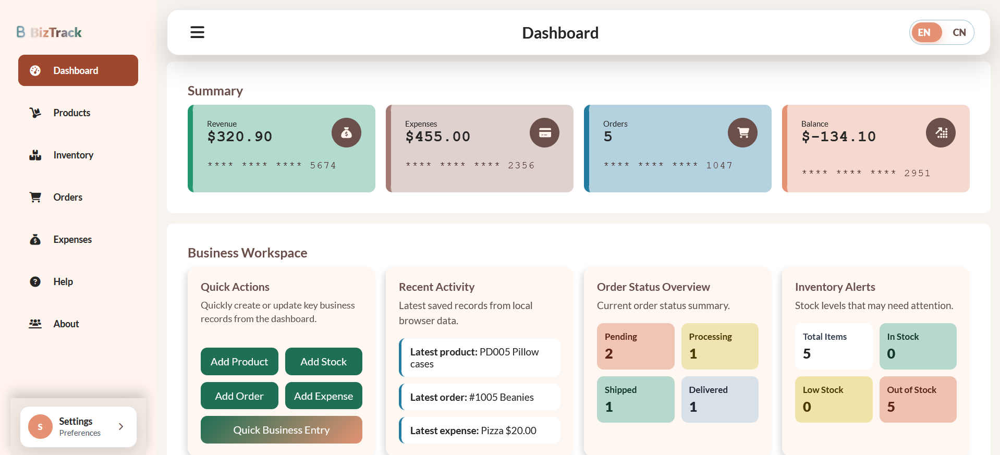

# 📋 BizTrack - CPT304 Group43

BizTrack is a lightweight frontend business management web application designed to help small businesses manage products, inventory, orders, expenses, and business summaries in one place.

This project was originally based on a simple order management application. For CPT304 Coursework 1, our group enhanced it through a research-led software improvement process. The updated version focuses on accessibility, safer data handling, responsive design, internationalization, privacy awareness, and a more complete business workflow.

The current BizTrack prototype is a frontend-only application. Business data and interface preferences are stored in the user's browser through `localStorage`. There is no backend account system or cloud database in this version.

---

## 📝 Live Demo

Please refer to:

[CPT304-GROUP43 BizTrack Demo](https://cpt304-group43-biztrack-order-management-ltl8.onrender.com/)

---

## 📷 Screenshots



---

## 📌 Key Features

- **Product Management**  
  Add, edit, delete, search, and export product records.

- **Inventory Management**  
  Manage stock quantities, reorder levels, suppliers, inventory status, and stock alerts. Inventory records can be linked with product records.

- **Order Tracking**  
  Create and manage orders with order status tracking. Order status can be connected with inventory deduction logic when products are shipped or delivered.

- **Expenses Management**  
  Record expenses, categorize financial transactions, validate expense amounts, and export expense data.

- **Insightful Dashboard**  
  View business summary cards, recent activity, order status overview, inventory alerts, and analytics charts.

- **Quick Business Entry**  
  Use the Dashboard quick-entry modal to add or edit products, inventory, orders, and expenses without navigating between pages.

- **Search and Sort Entries**  
  Search business records and sort table entries across the main management pages.

- **Analytics**  
  View sales by product category and expense distribution through dashboard charts.

- **Export to CSV**  
  Export product, order, inventory, and expense data into CSV format.

- **English / Chinese Interface**  
  Switch between English and Chinese. The selected language is saved in the browser.

- **Light / Dark Theme**  
  Switch between light and dark interface themes. The selected theme is saved locally.

- **Settings Center**  
  Manage preferences, local data storage, and privacy information from a unified Settings Center.

- **Cookie and Privacy Support**  
  Cookie choice and privacy information are integrated into the app. Users can accept or reject optional storage and review the Privacy Policy inside the Settings Center.

- **Responsive Sidebar and Layout**  
  The sidebar and main content layout are improved for desktop, narrow screens, and mobile-style viewports.

---

## 🔧 Main Improvements for CPT304

The original BizTrack application was enhanced through multiple development steps. Major improvements include:

### Accessibility Improvements
- Improved text and UI contrast.
- Replaced non-semantic clickable elements with proper buttons or links.
- Added better keyboard focus styles.
- Improved sidebar navigation and current-page indication.
- Reduced layout overlap on smaller screens.

### Safer DOM and Data Handling
- Reduced unsafe `innerHTML` usage.
- Used safer DOM manipulation and `textContent` where appropriate.
- Added stronger localStorage validation and fallback behavior.
- Improved handling of corrupted or invalid stored data.

### Form Validation
- Added validation for products, orders, inventory, and expenses.
- Prevented duplicate product/order IDs.
- Restricted numeric fields to valid ranges.
- Blocked invalid expense values such as zero or negative amounts.

### Internationalization
- Added English and Chinese language support.
- Centralized translation strings in `i18n.js`.
- Saved the selected language preference in localStorage.
- Updated static text, placeholders, ARIA labels, and dashboard content after language changes.

### Privacy and Local Storage Transparency
- Added cookie consent controls.
- Moved Privacy Policy content into the Settings Center.
- Clearly explained that business data is stored in the current browser through localStorage.
- Removed incomplete user-login assumptions and replaced them with a Settings-focused workflow.

### Business Workflow Enhancement
- Added an Inventory page.
- Connected Products → Inventory → Orders → Expenses into a clearer business process.
- Added dashboard inventory alerts.
- Added Quick Business Entry as a faster dashboard-based workflow.

---

## 🧭 Current Business Workflow

BizTrack now follows this business logic:

```text
Products → Inventory → Orders → Expenses / Dashboard Analytics
